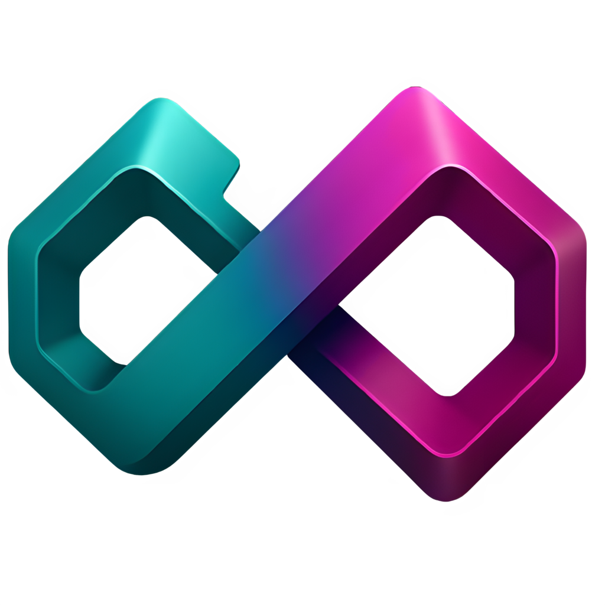
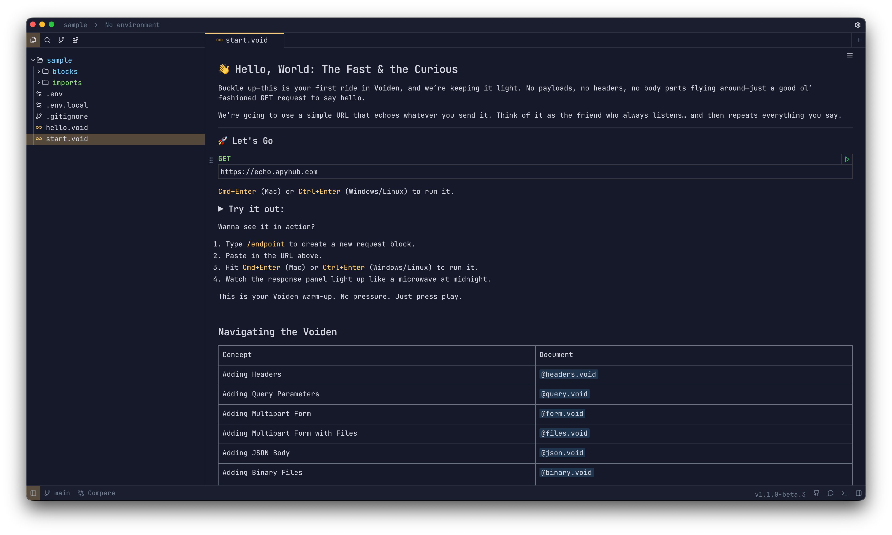

<br/>

<p align="center">
<a href="https://voiden.md">

</a>
</p>
<p align="center">
  <a href="https://www.linkedin.com/showcase/voiden/">
    
  </a>
  <a href="https://x.com/VoidenMD">
    
  </a>
  <a href="https://discord.com/invite/XSYCf7JF4F">
    
  </a>
  <a href="https://docs.voiden.md/docs/getting-started-section/intro" rel="nofollow"></a>
</p>

**Voiden** is an offline-first API client and workspace for developers, API testers and technical writers who want clarity, speed, and control. It lets you build, test, and link API requests like reusable blocks, comment on JSON or XML, preview responses (even PDFs or videos), and manage environments, themes, and scripts. The best part is that Voiden enables all this without ever needing the cloud. Voiden could be seen as your API lab: local, fast, beautifully nerdy, and just the right amount of judgmental.



---

### 📦 Download  
**Version 1.1.0 is now available!**

👉 **[Download Voiden ↗️](https://voiden.md/download)**  

The website will automatically detect your operating system and highlight the correct installer for you.
(Windows, macOS Intel/Apple Silicon, and Linux).


>🔧 Looking for the **beta** builds?  [Download beta versions ↗️](https://voiden.md/download#beta)

## Getting Started

### 1. Found a bug?

Head over to the [Issues](https://github.com/voidenhq/feedback/issues) tab and click **"New issue"**. Use the **Bug report** template to give us everything we need to fix it.

### 2. Have a feature idea?

We love hearing about new possibilities. Use the **Feature request** template to tell us what you have in mind.

### 3. Just want to say something?

Open a general issue or leave a note.

---

Thanks for sharing your thoughts with us 💜

---

## Quick Start (Local Development)

### Prerequisites

- Node.js v21.x
- Yarn v4.3.1
- **Windows Only**: [Visual Studio Build Tools](https://visualstudio.microsoft.com/visual-cpp-build-tools/) with:
  - "Desktop development with C++" workload
  - MSVC (C++ compiler)
  - Windows SDK

```bash
git clone https://github.com/VoidenHQ/voiden.git
cd voiden
yarn install
yarn workspace @voiden/core-extensions build
cd apps/electron && yarn start
```

See the [Full Installation Guide](docs/getting-started/FRESH_INSTALL.md) for detailed setup including Windows requirements.

## Documentation

All documentation is in the [docs/](docs/) folder:

| Topic | Description |
|-------|-------------|
| [Getting Started](docs/getting-started/FRESH_INSTALL.md) | Installation and setup |
| [Architecture](docs/architecture/OVERVIEW.md) | System design and structure |
| [Extensions](docs/extensions/HOW_TO_ADD.md) | Build your own extensions |
| [Themes](docs/customization/THEMES.md) | Create custom themes |
| [Troubleshooting](docs/troubleshooting/COMMON_ISSUES.md) | Common issues and solutions |

See the [Documentation Index](docs/INDEX.md) for the complete list.

## Project Structure

```
voiden/
├── apps/
│   ├── electron/          # Electron main process
│   └── ui/                # React renderer
├── core-extensions/       # Built-in extensions
└── docs/                  # Documentation
```

## Contributing

We welcome contributions! Please read:

- [Contributing Guide](CONTRIBUTING.md) - How to contribute
- [Code of Conduct](CODE_OF_CONDUCT.md) - Community guidelines
- [Security Policy](SECURITY.md) - Reporting vulnerabilities

## License

This project is licensed under the [Apache License 2.0](LICENSE).

## Links

- [Changelog](changelog.md)
- [Documentation](docs/INDEX.md)
- [Report an Issue](https://github.com/VoidenHQ/voiden/issues)
